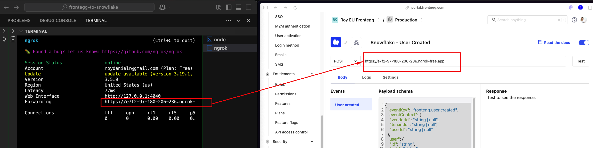

# Frontegg to Snowflake Webhook Receiver

This project is a Flask-based application that listens for incoming webhook events from Frontegg on the `/` route. When an event is received, the application parses the JSON payload, extracts key fields, and inserts the data into a Snowflake table. The application also stores the raw JSON payload for further analysis.

## Features

- **Webhook Endpoint:** Receives POST requests containing Frontegg webhook events.
- **JSON Parsing:** Extracts key values (such as event key, user ID, user name, user email, and creation timestamp) from the payload.
- **Snowflake Integration:** Inserts both the raw JSON payload and the parsed values into a Snowflake table.
- **Environment Variables:** Uses a `.env` file to securely store and load configuration values.
- **Local Tunneling (ngrok):** Option to create an ngrok tunnel to expose your local server for testing with Frontegg.

## Prerequisites

- Python 3.7 or higher
- A Snowflake account with the proper credentials and access.
- [ngrok](https://ngrok.com/) (optional, for exposing your local server to the internet)

## Creating the Snowflake Database and Table Schema
Before running the application, you need to create the target database, schema, and table in Snowflake. Follow these steps:

1. Log in to your Snowflake account and navigate to Projects ➜ Worksheets ➜ Create SQL Worksheet.

2. Create the database (if it does not already exist):
```
CREATE DATABASE IF NOT EXISTS MY_DB;
```
3. Switch to the database and schema:
```
USE DATABASE MY_DB;
CREATE SCHEMA IF NOT EXISTS PUBLIC;
USE SCHEMA PUBLIC;
```
4. Create the table for storing webhook events:
```
CREATE TABLE IF NOT EXISTS FRONTEGG_EVENTS (
  EVENT_ID         STRING,        -- Auto-generated UUID 
  EVENT_KEY        STRING,        -- Extracted from JSON 
  USER_ID          STRING,        -- Extracted from JSON
  USER_NAME        STRING,        -- Extracted from JSON 
  USER_EMAIL       STRING,        -- Extracted from JSON 
  USER_CREATED_AT  TIMESTAMP_NTZ, -- Extracted from JSON and converted to a timestamp
  RAW_PAYLOAD      VARIANT        -- Full JSON payload stored as VARIANT
);
```

## Installation

1. **Clone the repository:**

   ```bash
   git clone <your-repo-url>
   cd <your-repo-directory>
   ```

2.  Install the dependencies:
    ```
    pip install flask snowflake-connector-python python-dotenv
    ```

## Configuration
1. Create a .env file in the project root, replace with your actual values:
    ```
    # Snowflake credentials
    SNOWFLAKE_ACCOUNT=ddb43111.us-east-1        
    SNOWFLAKE_USER=ROYD                   
    SNOWFLAKE_PASSWORD=xxxxxxxxx          
    SNOWFLAKE_WAREHOUSE=COMPUTE_WH                 
    SNOWFLAKE_ROLE=ACCOUNTADMIN                   
    SNOWFLAKE_DATABASE=MY_DB                      
    SNOWFLAKE_SCHEMA=PUBLIC                       
    SNOWFLAKE_TABLE=FRONTEGG_EVENTS               

    # Flask application port
    APP_PORT=4000 
    ```

You can run the following queries in Snowflake to get the information
```
-- Returns the current Snowflake account name.
SELECT CURRENT_ACCOUNT();

-- Returns the current Snowflake user.
SELECT CURRENT_USER();

-- Returns the current Snowflake warehouse.
SELECT CURRENT_WAREHOUSE();

-- Returns the current database.
SELECT CURRENT_DATABASE();

-- Returns the current schema.
SELECT CURRENT_SCHEMA();

-- Lists all roles in your Snowflake account.
SHOW ROLES;

```


2. Ensure your `.env` file is ignored by Git:
```
# Ignore environment variable files
.env
```

## Running the Application
1. Start the Flask server:
```
python3 app.py
```
The application will start listening on `http://0.0.0.0:5000.`

2. Test the webhook locally:
You can use tools like Postman or curl to send a POST request to the endpoint:
```
curl -X POST http://localhost:5000/ -H "Content-Type: application/json" -d '{"eventKey": "frontegg.user.created", "user": {"id": "0e0abe4b-751d-46cf-aaa9-a000e8bd902a", "name": "test", "email": "test@acme.com", "createdAt": "2025-02-06T15:54:11.000Z"}}'
```

3. Exposing Your Local Server with ngrok (Optional)
To test webhook integrations from Frontegg, you may need to expose your local server to the internet. You can use ngrok for this purpose.

- Download and install ngrok if you haven't already - https://ngrok.com/
- Run ngrok to tunnel your local port (using the port specified in your .env file):
    ```
    ngrok http 4000
    ```
    (Replace 4000 with the value of APP_PORT if different.)

Copy the generated public URL from the ngrok dashboard and configure your Frontegg webhook to point to this URL.


## Retrieve all data from the table
```
SELECT * FROM FRONTEGG_EVENTS;
```